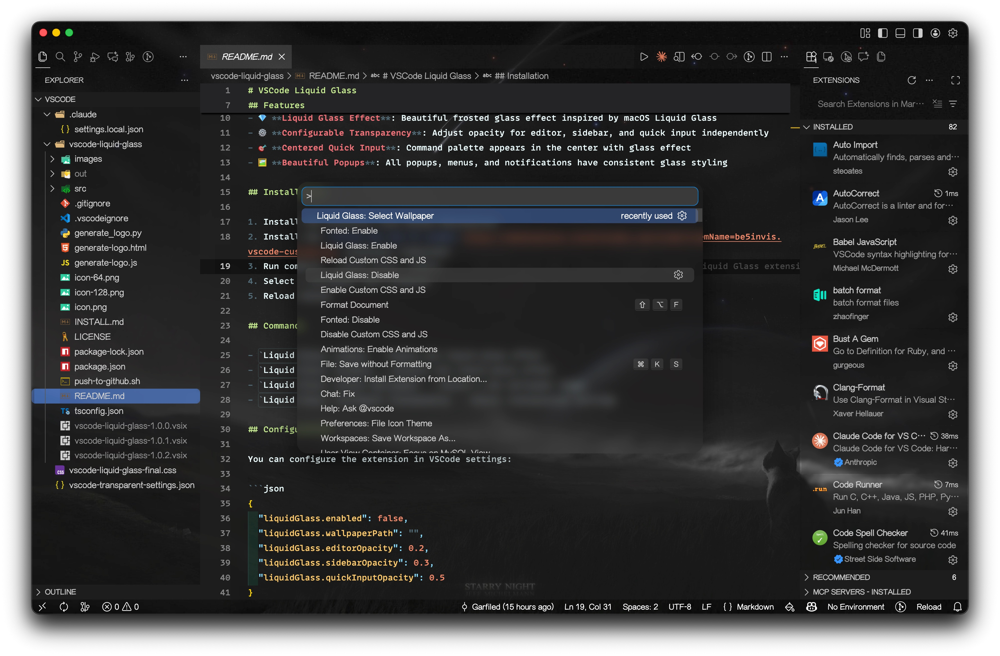

# VSCode Liquid Glass

Beautiful liquid glass effect for VSCode with customizable wallpaper and transparency settings.



## Features

- 🎨 **Custom Wallpaper**: Use your own images as VSCode background
- 💎 **Liquid Glass Effect**: Beautiful frosted glass effect inspired by macOS Liquid Glass
- ⚙️ **Configurable Transparency**: Adjust opacity for editor, sidebar, and quick input independently
- 🎯 **Centered Quick Input**: Command palette appears in the center with glass effect
- 🖼️ **Beautiful Popups**: All popups, menus, and notifications have consistent glass styling

## Installation

1. Install the extension from VSCode Marketplace
2. Install the [Custom CSS and JS Loader](https://marketplace.visualstudio.com/items?itemName=be5invis.vscode-custom-css) extension (required)
3. Run command: `Liquid Glass: Enable`
4. Select a wallpaper when prompted
5. Reload VSCode

## Commands

- `Liquid Glass: Enable` - Enable the liquid glass effect
- `Liquid Glass: Disable` - Disable the liquid glass effect
- `Liquid Glass: Select Wallpaper` - Choose a new wallpaper image
- `Liquid Glass: Configure Transparency` - Adjust transparency settings

## Configuration

You can configure the extension in VSCode settings:

```json
{
  "liquidGlass.enabled": false,
  "liquidGlass.wallpaperPath": "",
  "liquidGlass.editorOpacity": 0.2,
  "liquidGlass.sidebarOpacity": 0.3,
  "liquidGlass.quickInputOpacity": 0.5
}
```

### Recommended Settings

For the best liquid glass effect, add these color customizations to your `settings.json`:

```json
{
  "workbench.colorCustomizations": {
    // Sidebar
    "sideBarSectionHeader.background": "#00000000",
    "sideBarTitle.background": "#00000000",

    // Activity Bar
    "activityBar.background": "#00000000",
    "activityBar.inactiveForeground": "#ffffff99",
    "activityBar.foreground": "#ffffff",

    // Title Bar
    "titleBar.activeBackground": "#00000000",
    "titleBar.inactiveBackground": "#00000000",

    // Editor Groups and Tabs
    "editorGroupHeader.tabsBackground": "#00000000",
    "editorGroupHeader.noTabsBackground": "#00000000",
    "tab.activeBackground": "#00000000",
    "tab.inactiveBackground": "#00000000",
    "tab.border": "#00000000",

    // Panel
    "panel.background": "#00000000",
    "panelTitle.activeBorder": "#00000000",
    "panelTitle.inactiveForeground": "#ffffff99",

    // Status Bar
    "statusBar.background": "#00000000",
    "statusBar.noFolderBackground": "#00000000",
    "statusBar.debuggingBackground": "#00000000",

    // Popups and Overlays
    "quickInput.background": "#00000000",
    "quickInputList.focusBackground": "#00000000",
    "menu.background": "#00000000",
    "menu.selectionBackground": "#00000000",
    "notificationCenterHeader.background": "#00000000",
    "notifications.background": "#00000000",
    "editorHoverWidget.background": "#00000000",
    "editorSuggestWidget.background": "#00000000",
    "editorSuggestWidget.selectedBackground": "#00000000",
    "editorWidget.background": "#00000000",
    "dialog.background": "#00000000",
    "dropdown.background": "#00000000",
    "dropdown.listBackground": "#00000000",
    "input.background": "#00000000",
    "list.hoverBackground": "#00000000",
    "list.activeSelectionBackground": "#00000000",
    "list.inactiveSelectionBackground": "#00000000",
    "list.focusBackground": "#00000000",
    "peekViewEditor.background": "#00000000",
    "peekViewResult.background": "#00000000",
    "peekViewTitle.background": "#00000000",
    "breadcrumb.background": "#00000000",
    "breadcrumbPicker.background": "#00000000",
    "notebook.editorBackground": "#00000000"
  }
}
```

> **Note**: These settings make VSCode UI elements transparent so the liquid glass effect and wallpaper can show through. You can adjust individual settings based on your preferences.

### Extension Settings

- `liquidGlass.enabled`: Enable/disable liquid glass effect
- `liquidGlass.wallpaperPath`: Path to wallpaper image
- `liquidGlass.editorOpacity`: Editor area opacity (0 = transparent, 1 = opaque)
- `liquidGlass.sidebarOpacity`: Sidebar opacity (0 = transparent, 1 = opaque)
- `liquidGlass.quickInputOpacity`: Quick input opacity (0 = transparent, 1 = opaque)

## Requirements

This extension requires the [Custom CSS and JS Loader](https://marketplace.visualstudio.com/items?itemName=be5invis.vscode-custom-css) extension to work.

## Preview

Experience the beautiful liquid glass effect with your custom wallpaper:


The extension provides:
- ✨ Transparent editor with customizable opacity
- 🎨 Beautiful sidebar with glass effect
- 🌟 Centered quick input panel with frosted glass
- 💫 Consistent glass styling across all UI elements

## Usage

1. **Select a Wallpaper**:
   - Run `Liquid Glass: Select Wallpaper`
   - Choose an image file (PNG, JPG, etc.)

2. **Enable the Effect**:
   - Run `Liquid Glass: Enable`
   - Reload VSCode when prompted

3. **Adjust Transparency** (Optional):
   - Run `Liquid Glass: Configure Transparency`
   - Choose which area to adjust
   - Enter a value between 0 and 1

4. **Disable** (if needed):
   - Run `Liquid Glass: Disable`
   - Reload VSCode

## Troubleshooting

### Extension not working?

1. Make sure [Custom CSS and JS Loader](https://marketplace.visualstudio.com/items?itemName=be5invis.vscode-custom-css) is installed
2. After enabling, make sure to reload VSCode
3. Check that your wallpaper path is correct

### "Unsupported" warning?

This is normal! The Custom CSS extension modifies VSCode files. The warning can be safely dismissed. To remove the warning badge, you can use the [Fix VSCode Checksums](https://marketplace.visualstudio.com/items?itemName=lehni.vscode-fix-checksums) extension.

### Background not showing?

1. Verify the wallpaper path in settings
2. Make sure the image file exists and is accessible
3. Try selecting the wallpaper again using `Liquid Glass: Select Wallpaper`

## Known Issues

- VSCode may show an "Unsupported" warning after enabling (this is expected)
- Some themes may have conflicts with the glass effect
- Performance may vary based on system capabilities

## Contributing

Contributions are welcome! Please feel free to submit issues and pull requests.

## License

MIT

## Credits

Inspired by macOS Liquid Glass design language.
